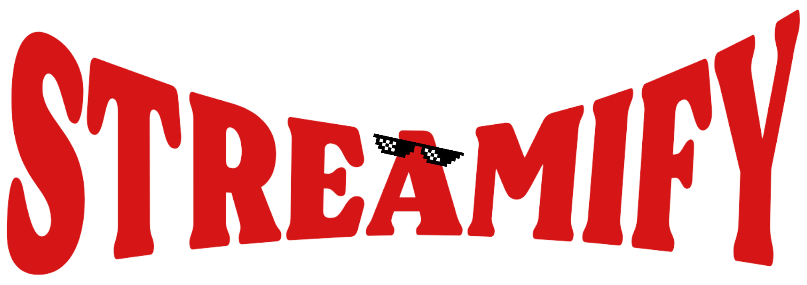

# Streamify

A modern movie and TV show discovery web application built with React, Vite, and Tailwind CSS. Streamify leverages the [TMDB API](https://www.themoviedb.org/documentation/api) to provide users with trending, popular, and top-rated movies and TV shows, as well as detailed information, trailers, and a personal favorites list.



## Table of Contents

- [Features](#features)
- [Demo](#demo)
- [Tech Stack](#tech-stack)
- [Getting Started](#getting-started)
- [Project Structure](#project-structure)
- [Environment Variables](#environment-variables)
- [Scripts](#scripts)
- [License](#license)

## Features

- 🎬 Browse trending, popular, top-rated, and upcoming movies and TV shows
- 🔍 Search for movies and TV shows
- ⭐ Add or remove favorites (persisted in session)
- 📺 Watch trailers directly from the app
- 📄 Detailed movie and TV show pages with cast and crew info
- 🎨 Responsive UI with Tailwind CSS and Flowbite React components

## Demo

> _Add a link to your deployed app or screenshots here._

## Tech Stack

- [React](https://react.dev/)
- [Vite](https://vitejs.dev/)
- [Tailwind CSS](https://tailwindcss.com/)
- [Flowbite React](https://flowbite-react.com/)
- [Axios](https://axios-http.com/)
- [TMDB API](https://www.themoviedb.org/documentation/api)

## Getting Started

### Prerequisites

- [Node.js](https://nodejs.org/) (v16 or higher recommended)
- [npm](https://www.npmjs.com/) or [yarn](https://yarnpkg.com/)

### Installation

1. **Clone the repository:**

   ```sh
   git clone https://github.com/yourusername/streamify.git
   cd streamify
   ```

2. **Install dependencies:**

   ```sh
   npm install
   # or
   yarn install
   ```

3. **Set up environment variables:**

   - Copy `.env.example` to `.env` and add your [TMDB API key](https://www.themoviedb.org/settings/api):

     ```
     VITE_TMDB_KEY=your_tmdb_api_key
     ```

4. **Run the development server:**

   ```sh
   npm run dev
   # or
   yarn dev
   ```

   The app will be available at [http://localhost:5173](http://localhost:5173) by default.

## Project Structure

```
.
├── public/
├── src/
│   ├── assets/           # Images and icons
│   ├── components/       # Reusable UI components
│   ├── Layout/           # Main layout (Navbar, Footer)
│   ├── pages/            # Page components (Home, Movie, TV Shows, etc.)
│   ├── utils/            # Utility functions (Axios instance)
│   ├── main.jsx          # App entry point
│   ├── router.jsx        # React Router configuration
│   └── index.css         # Tailwind CSS and custom styles
├── .env.example
├── package.json
├── tailwind.config.js
├── vite.config.js
└── README.md
```

## Environment Variables

Create a `.env` file in the root directory with the following variable:

```
VITE_TMDB_KEY=your_tmdb_api_key
```

You can obtain a TMDB API key by creating an account at [TMDB](https://www.themoviedb.org/) and requesting an API key.

## Scripts

- `npm run dev` — Start the development server
- `npm run build` — Build for production
- `npm run preview` — Preview the production build
- `npm run lint` — Run ESLint

## License

MIT

---

> _This project is for educational purposes and uses the TMDB API but is not endorsed or certified by TMDB._
